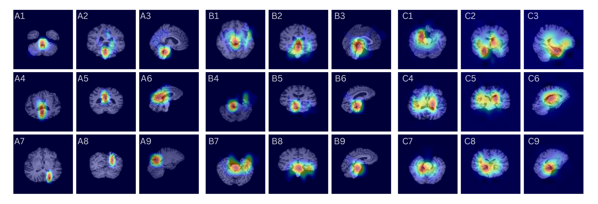
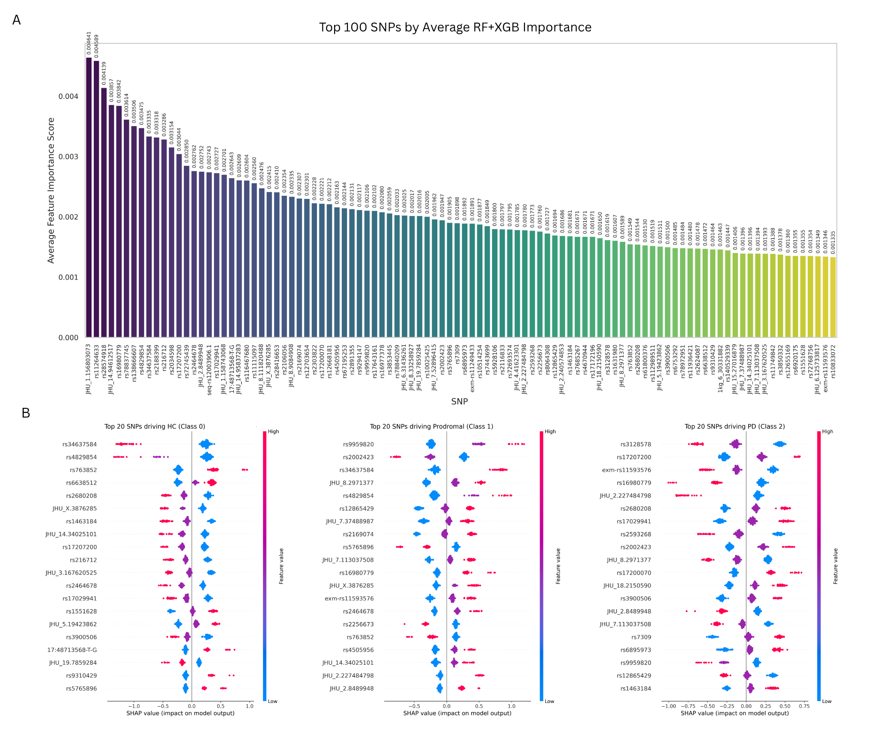

# CAGF-Net: Cross-Attentive Gated Fusion Network for Early Parkinson’s Disease Diagnosis

> A novel, explainable multimodal deep learning framework for the multi-class staging of Parkinson's Disease (Healthy Control, Prodromal, and diagnosed PD) using structural MRI, DTI-derived microstructural features, and genomic (SNP) data.

[](https://www.python.org/)
[](https://pytorch.org/)
[](https://opensource.org/licenses/MIT)

## Overview

Early diagnosis of Parkinson's Disease (PD) remains a significant challenge due to delayed motor symptom onset, severe clinical data scarcity in the prodromal phase, and the inherent limitations of static multimodal fusion methods. 

CAGF-Net addresses these limitations by dynamically integrating macroscale neuroanatomical decay with microscale genomic susceptibility. The fully balanced trimodal CAGF-Net framework achieves a **diagnostic accuracy of 96.9%** and an **AUC of 0.988** within a subject-wise 5-fold cross-validation on the Parkinson's Progression Markers Initiative (PPMI) cohort.

### Key Features
* **Multimodal Feature Extraction:** Utilizes a pre-trained 3D ResNet-18 to extract spatial features from co-registered structural MRI (sMRI) and diffusion tensor imaging (DTI), paired with a Transformer sequence encoder for single-nucleotide polymorphisms (SNPs).
* **Latent-Space SMOTified-GAN:** Balances the training manifold by generating synthetic minority-class samples (HC and Prodromal) entirely within a joint 1024-dimensional latent space. This preserves cross-modal genotype-phenotype correlations while bypassing the prohibitive computational cost of 3D volume synthesis.
* **Cross-Attentive Gated Fusion:** Employs bi-directional cross-attention and adaptive gating mechanisms, regularized by a cross-modal contrastive alignment loss, to dynamically assign modality-specific trust weights and effectively model non-linear interactions.
* **Dual-Pathway Explainable AI (XAI):** Integrates SHAP to isolate top predictive genetic loci and 3D Grad-CAM to visualize stage-specific neuroanatomical attention (e.g., basal ganglia and midbrain), ensuring clinical interpretability.

---

## Data Availability & Privacy Notice

**Please Note:** Due to strict data privacy regulations and the Data Use Agreement of the Parkinson's Progression Markers Initiative (PPMI), raw neuroimaging NIfTI files and raw genomic PLINK files cannot be shared publicly. 

To ensure full reproducibility of our predictive models without compromising patient privacy, we provide the **extracted, anonymized 1D feature vectors** in the `data/extracted_features/` directory. Researchers can run the core CAGF-Net training and evaluation pipeline directly using these features.

*To obtain the raw data, researchers must register and apply for access directly through the [PPMI Data Portal](https://www.ppmi-info.org).*


## Repository Structure
```text
CAGF-Net/
│
├── data/
│   ├── extracted_features/         # <-- PROVIDED FOR REPRODUCIBILITY
│      ├── aligned_mri_dti_512.csv # Extracted 512-dim imaging features
│      └── 512_genetic_features.csv# Extracted 512-dim genomic features 
│   
│   
│
├── scripts/
│   ├── 1_genomic_preprocessing_cv.py           # Provided for transparency
│   ├── 2a_neuroimaging_smri_baseline.py        # Provided for transparency
│   ├── 2b_neuroimaging_early_fusion(smri+dti).py # Provided for transparency
│   ├── 3_cagf_architectures.py                 # Core Architectures
│   ├── 4_train_trimodal_cagf_net_cv.py         # Main Execution Script
│   ├── 5a_xai_shap_genomics.py                 # XAI Analysis
│   └── 5b_xai_gradcam_imaging.py               # XAI Analysis
│
├── results/                        
│   └── xai_plots/                  # Pre-saved SHAP and Grad-CAM PNGs
│
└── README.md                       # Project documentation
```
## Interpretability Results (XAI)

The following visualizations demonstrate the explainability of **CAGF-Net** in identifying stage-specific biomarkers for Parkinson's Disease.

### 1. Neuroimaging Interpretability (3D Grad-CAM)
The model identifies significant neuroanatomical decay in the basal ganglia and midbrain regions, aligned with clinical expectations for PD staging.



### 2. Genomic Interpretability (SHAP)
SHAP analysis isolates the top predictive SNPs, highlighting the genetic loci most influential in the transition from HC to Prodromal stages.


## Quick Start: Reproducing Results
1. Installation
Install the required dependencies via pip:
```text
# Core execution dependencies
pip install torch torchvision numpy pandas scikit-learn imbalanced-learn xgboost

# Preprocessing & XAI dependencies
pip install shap matplotlib scipy bed-reader antspyx SimpleITK dipy nibabel
```
## 2. Run the Pipeline
The main script handles stratified 5-fold cross-validation, training of the SMOTified-GAN on training folds, and CAGF-Net optimization:

```text

python scripts/4_train_trimodal_Cagf-net_cv.py
```
## Reproducibility Note
Deep learning models involving cross-attention mechanisms may exhibit slight stochasticity during GPU execution due to non-deterministic CUDA atomic operations. While random seeds (e.g., 42) are fixed in the code, minor fluctuations (±0.5%) in final metrics are expected depending on hardware and library versions.

## Citation
Please note that this work is currently in the drafting/review stage. For citations, please use the following temporary format:

## Code snippet
```text
@article{amin2026cagfnet,
  title={CAGF-Net: An Explainable Cross-Attentive Gated Fusion Network with Latent-Space SMOTified-GAN for Early Parkinson’s Disease Diagnosis},
  author={Amin, Mohsin and Sabri, Aznul Qalid Md and Li, Shuotian and Samad, Abdul and Maqbool, Haseeba and Long, Guojun},
  journal={In Review},
  year={2026}
}
```
## Acknowledgments
We acknowledge the Parkinson’s Progression Markers Initiative (PPMI) investigators and participants for making the data available. PPMI is sponsored by The Michael J. Fox Foundation.
